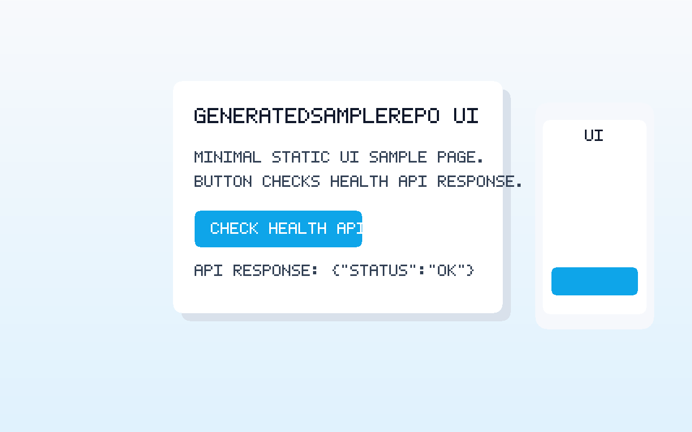

# GeneratedSampleRepo

最小構成の API サーバーです。`GET /` で UI、`GET /api/health` でヘルスチェック API を提供します。

## 起動手順

```bash
python3 app.py
```

デフォルトで `0.0.0.0:8000` で待ち受けます。必要に応じて環境変数で変更できます。

```bash
HOST=127.0.0.1 PORT=8001 python3 app.py
```

## 動作確認

### UI

ブラウザで以下にアクセスしてください。

```text
http://localhost:8000/
```

ページ上にタイトル、説明文、`Health API を確認` ボタンが表示されます。



### API

```bash
curl -i http://localhost:8000/api/health
```

期待されるレスポンス:

- ステータス: `HTTP/1.0 200 OK` または `HTTP/1.1 200 OK`
- ヘッダー: `Content-Type: application/json`
- ボディ: `{"status":"ok"}`

## テスト

```bash
python3 -m unittest discover -s tests -p "test_*.py"
```
